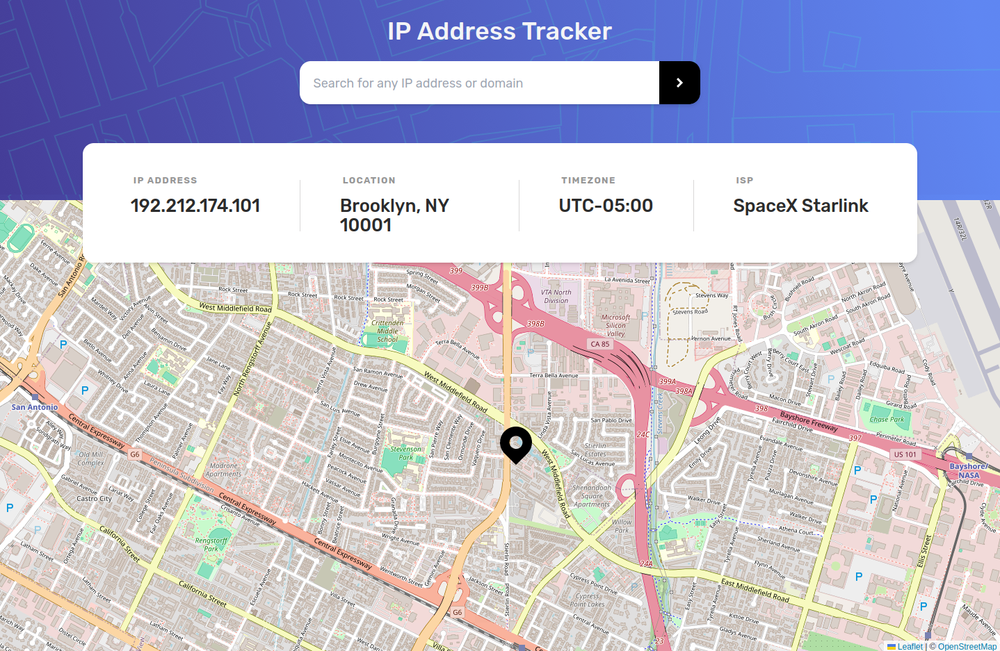
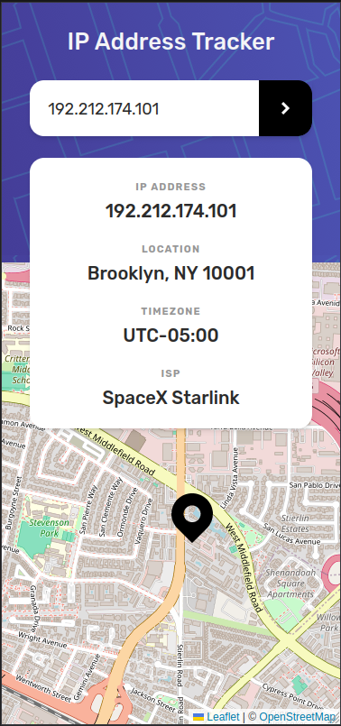

# Frontend Mentor - IP address tracker solution

This is a solution to the [IP address tracker challenge on Frontend Mentor](https://www.frontendmentor.io/challenges/ip-address-tracker-I8-0yYAH0). Frontend Mentor challenges help you improve your coding skills by building realistic projects.

## Table of contents

- [Overview](#overview)
  - [The challenge](#the-challenge)
  - [Screenshot](#screenshot)
  - [Links](#links)
- [My process](#my-process)
  - [Built with](#built-with)
  - [What I learned Using:](#what-i-learned-using)
    - [TailwindCSS](#tailwindcss)
    - [NextJS](#nextjs)
    - [Geo Location](#geo-location)
  - [Useful resources](#useful-resources)
- [Author](#author)

## Overview

### The challenge

Users should be able to:

- View the optimal layout for each page depending on their device's screen size
- See hover states for all interactive elements on the page
- See their own IP address on the map on the initial page load
- Search for any IP addresses or domains and see the key information and location

### Screenshot



<div style="text-align: center;">
  
</div>

### Links

- [Live Site URL](https://ip-address-tracker-sigma-khaki.vercel.app/)

## My process

### Built with

- [React](https://reactjs.org/) - JS library
- [Next.js](https://nextjs.org/) - React framework
- [TailwindCSS](https://tailwindcss.com/) - CSS framework
- [LeafletJS](https://leafletjs.com/) - JS library for drawing maps
- [IP Geolocation API by IPify](https://geo.ipify.org/)

### What I learned Using:

#### TailwindCSS

- Breakpoints with TailwindCSS

  In the following example the default max width will apply until it hits the `lg` breakpoint, then that style will be applied:

  ```jsx
  <div className="max-w-md lg:max-w-none">
  ```

- Customizing tailwind default theme. See `tailwind.config.js`
- Using SVG as a React component rather than using it like an image (ie. in img tags). See `app/_components/ArrowIcon.jsx`
- Using psuedo elements to add a vertical line decoration:

  NOTE: you can't add psuedo elements in tailwindCSS (I think?).

  ```css
  /* globals.css */
  .vertical-line {
    position: relative;
  }

  .vertical-line::after {
    content: "";
    position: absolute;
    background-color: #d9d7d7;
    height: 70%;
    width: 1px;
    top: 50%;
    transform: translateY(-40%);
  }
  ```

#### NextJS

- Setup API routes in Next App Router. I did this so I could hide my api key for the Geo location api.

#### Geo Location

The location given by the geo location service might not always be accurate, especially for individual users. Why:

- If you have a dynamic IP address it might give the location for the ISP (Internet Service Provider) instead.
- Geolocation databases used by IP address lookup services may not always be accurate or up to date.

### Useful resources

- An excellent [TailwindCSS Cheatsheet](https://nerdcave.com/tailwind-cheat-sheet)
- Tailwind Docs: [Theme Configuration](https://tailwindcss.com/docs/theme)
- GET & POST api routes in NextJS App Router [example repo](https://github.com/iambstha/blog-post-request-nextjs-app-router/blob/master/app/page.js)

## Author

- Frontend Mentor - [@tomahawk-jupiter](https://www.frontendmentor.io/profile/tomahawk-jupiter)

[Page Top](#table-of-contents)
